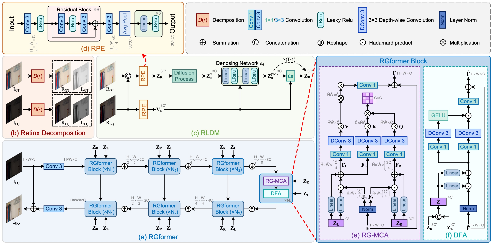
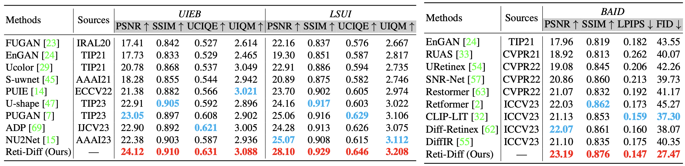
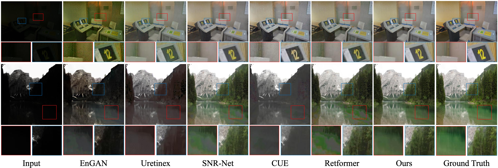
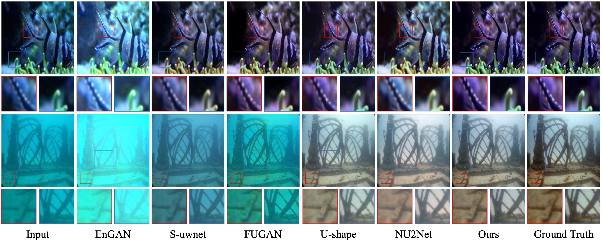
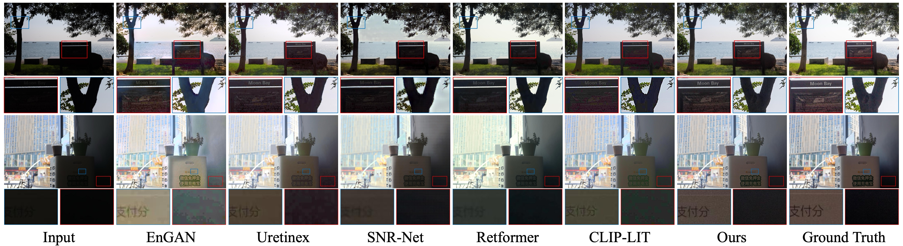

# Reti-Diff: Illumination Degradation Image Restoration with Retinex-based Latent Diffusion Model

[Chunming He](https://chunminghe.github.io/), [Chengyu Fang](https://cnyvfang.github.io/), [Yulun Zhang](https://yulunzhang.com), [Tian Ye](https://owen718.github.io), [Kai Li](https://kailigo.github.io), Longxiang Tang, Zhenhua Guo, Xiu Li and Sina Farsiu 

"Reti-Diff: Illumination Degradation Image Restoration with Retinex-based Latent Diffusion Model", ICLR, 2025 [[arXiv]](https://arxiv.org/abs/2311.11638)

#### 🔥🔥🔥 News

- **2025-02-11:** We are updating the code in the repository, and the version currently in the repository is not the final release version.
- **2023-11-21:** We release this repository.

> **Abstract:** Illumination degradation image restoration (IDIR) techniques aim to improve the visibility of degraded images and mitigate the adverse effects of deteriorated illumination. Among these algorithms, diffusion model (DM)-based methods have shown promising performance but are often burdened by heavy computational demands and pixel misalignment issues when predicting the image-level distribution. To tackle these problems, we propose to leverage DM within a compact latent space to generate concise guidance priors and introduce a novel solution called Reti-Diff for the IDIR task. Reti-Diff comprises two key components: the Retinex-based latent DM (RLDM) and the Retinex-guided transformer (RGformer). To ensure detailed reconstruction and illumination correction, RLDM is empowered to acquire Retinex knowledge and extract reflectance and illumination priors. These priors are subsequently utilized by RGformer to guide the decomposition of image features into their respective reflectance and illumination components. Following this, RGformer further enhances and consolidates the decomposed features, resulting in the production of refined images with consistent content and robustness to handle complex degradation scenarios. Extensive experiments show that Reti-Diff outperforms existing methods on three IDIR tasks, as well as downstream applications.




## 🔧 Todo

- [ ] Complete this repository


## 🔗 Contents

- [x] [Requirements](https://github.com/ChunmingHe/Reti-Diff/blob/main/README.md#-requirements)
- [ ] Training
- [x] [Testing](https://github.com/ChunmingHe/Reti-Diff/blob/main/README.md#-testing)
- [x] [Results](https://github.com/ChunmingHe/Reti-Diff/blob/main/README.md#-results)
- [x] [Citation](https://github.com/ChunmingHe/Reti-Diff/blob/main/README.md#-citation)
- [x] [Acknowledgements](https://github.com/ChunmingHe/Reti-Diff/blob/main/README.md#-acknowledgements)

## Requirements

Test Datasets: [Google Drive](https://drive.google.com/file/d/1r7Xaj8TuL_afy0svCtAfaXPqDmDWwuNR/view?usp=sharing)

Pretrained Models: [Google Drive](https://drive.google.com/file/d/13fHMg8DSLznjHqgB30khhP922EcbtpGG/view?usp=sharing)

## ⚙️ Dependencies

- Python 3.9
- Pytorch 2.1
- NVIDIA GPU + CUDA

### Initialize Environment
```bash
git clone https://github.com/cnyvfang/Reti-Diff-demo.git
cd Reti-Diff-demo
conda create -n Reti-Diff python=3.9
conda activate Reti-Diff
conda install pytorch torchvision torchaudio pytorch-cuda=12.1 -c pytorch -c nvidia
pip install -r requirements.txt
python setup.py develop
```

### Install BasicSR
```bash
git clone https://github.com/xinntao/BasicSR.git
cd BasicSR
pip install tb-nightly -i https://mirrors.aliyun.com/pypi/simple
pip install -r requirements.txt
python setup.py develop
cd ..
```

## ⚡️ Testing

1. Put the Test Datasets into Datasets folder.

2. Put the Pretrained Models into pretrained_models folder.

3. Run the following command to test the model:

```bash
# LLIE
sh test_LLIE.sh

# UIE
sh test_UIE.sh

# Backlit
sh test_Backlit.sh
```

## 🔍 Results

We achieved state-of-the-art performance on *low light image enhancement*, *underwater image enhancement*, *backlit image enhancement* and corresponding downstream tasks. More results can be found in the paper.

<details>
<summary>Quantitative Comparison (click to expand)</summary>

- Results in Table 1 of the main paper
  <p align="center">
  
	</p>
- Results in Table 2-3 of the main paper
  <p align="center">
  
	</p>
- Results in Table 6-9 of the main paper
  <p align="center">
  
	</p>
  </details>

<details>
<summary>Visual Comparison (click to expand)</summary>

- Results in Figure 3 of the main paper
  <p align="center">
  
	</p>
- Results in Figure 4 of the main paper
  <p align="center">
  
	</p>
- Results in Figure 5 of the main paper
  <p align="center">
  
	</p>
  </details>


## 📎 Citation

If you find the code helpful in your resarch or work, please cite the following paper(s).

```
@article{he2023retidiff,
      title={Reti-Diff: Illumination Degradation Image Restoration with Retinex-based Latent Diffusion Model}, 
      author={Chunming He and Chengyu Fang and Yulun Zhang and Kai Li and Longxiang Tang and Chenyu You and Fengyang Xiao and Zhenhua Guo and Xiu Li},
      year={2023},
      eprint={2311.11638},
      archivePrefix={arXiv},
      primaryClass={cs.CV}
}
```

## 💡 Acknowledgements
The codes are based on [BasicSR](https://github.com/XPixelGroup/BasicSR), [Restormer](https://github.com/swz30/Restormer), and [DiffIR](https://github.com/Zj-BinXia/DiffIR). Please also follow their licenses. Thanks for their awesome works.


